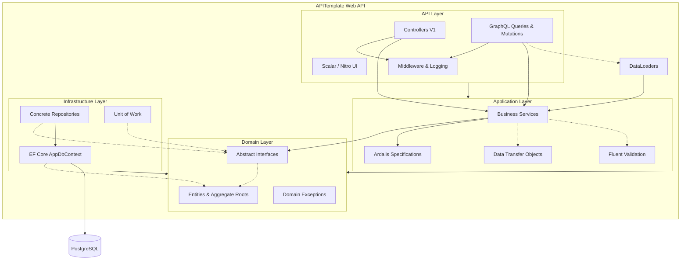
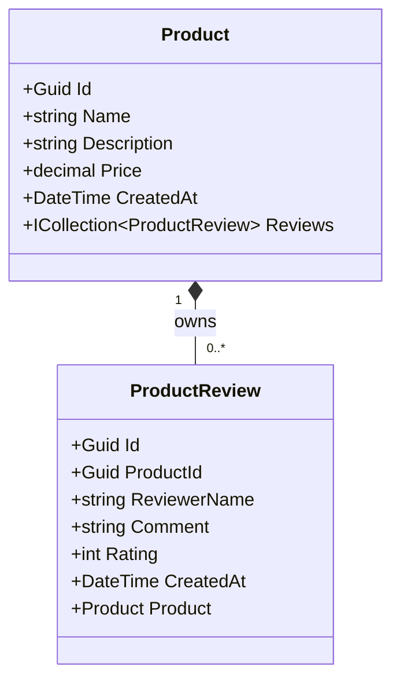

# APITemplate

A scalable, clean, and modern template designed to jumpstart **.NET 10** Web API and Data-Driven applications. By providing a curated set of industry-standard libraries and combining modern **REST** APIs side-by-side with a robust **GraphQL** backend, it bridges the gap between typical monolithic development speed and Clean Architecture principles within a single maintainable repository.

## 🚀 Key Features

*   **Architecture Pattern:** Clean mapping of concerns inside a monolithic solution (emulating Clean Architecture). `Domain` rules and interfaces are isolated from `Application` logic and `Infrastructure`.
*   **Dual API Modalities:**
    *   **REST API:** Clean HTTP endpoints using versioned controllers (`Asp.Versioning.Mvc`).
    *   **GraphQL API:** Complex query batching via `HotChocolate`, integrated Mutations and DataLoaders to eliminate the N+1 problem.
*   **Modern Interactive Documentation:** Native `.NET 10` OpenAPI integrations displayed smoothly in the browser using **Scalar** `/scalar`. Includes **Nitro UI** `/graphql/ui` for testing queries natively.
*   **Data Access:** Built on **Entity Framework Core 10** paired with a **PostgreSQL** database. Uses the **Repository** pattern tied firmly with a **Unit of Work** paradigm.
*   **Domain Filtering:** Seamless filtering, sorting, and paging powered by `Ardalis.Specification` to decouple query models from infrastructural EF abstractions.
*   **Enterprise-Grade Utilities:**
    *   **Validation:** Pipelined model validation using `FluentValidation.AspNetCore`.
    *   **Cross-Cutting Concerns:** Unified configuration via `Serilog` (Logging) and fully centralized Global Exception Management (`GlobalExceptionHandlerMiddleware`).
    *   **Authentication:** Pre-configured JWT secure endpoint access.
    *   **Observability:** Health Checks (`/health`) natively tracking database state.
*   **Robust Testing Engine:** Provides isolated internal `Integration` tests using test containers or `UseInMemoryDatabase` combined flawlessly with WebApplicationFactory.

---

## 🏗 Architecture Diagram

The application leverages a single `.csproj` separated rationally via namespaces that conform to typical clean layer boundaries. The goal is friction-free deployments and dependency chains while ensuring long-term code organization.



---

## 📦 Domain Class Diagram

This class diagram models the aggregate roots and entities located natively within `Domain/Entities/`.



---

## 🛠 Technology Stack

*   **Runtime:** `.NET 10.0` Web SDK
*   **Database:** PostgreSQL (`Npgsql`)
*   **ORM:** Entity Framework Core (`Microsoft.EntityFrameworkCore.Design`, `10.0`)
*   **API Toolkit:** ASP.NET Core, Asp.Versioning, `Scalar.AspNetCore`
*   **GraphQL Core:** HotChocolate `15.1`
*   **Utilities:** `Serilog.AspNetCore`, `FluentValidation`, `Ardalis.Specification`
*   **Test Suite:** xUnit, `Microsoft.AspNetCore.Mvc.Testing`

---

## 📂 Project Structure

This architecture deliberately leverages a single project (`APITemplate.csproj`) broken up securely by namespaces to mirror a traditional Clean Architecture without the multirepo/multiproject overhead:

```text
src/APITemplate/
├── Api/              # Presentation Tier (V1 REST Controllers, GraphQL Queries/Mutations, Global Middleware)
├── Application/      # Business Logic (Services, DTOs, FluentValidation, Ardalis Specs)
├── Domain/           # Core Logic (Entities, Value Objects, Domain Exceptions, Interfaces)
├── Infrastructure/   # Outer boundaries (AppDbContext, EF Core Repositories, Unit of Work)
└── Extensions/       # Startup IoC container bootstrappers
tests/APITemplate.Tests/
├── Integration/      # End-to-End API endpoint testing bridging a real/in-memory DB via WebApplicationFactory
└── Unit/             # Isolated internal service logic tests
```

---

## 🔐 Authentication & Examples

Most REST and GraphQL endpoints might be protected by JWT Authentication (`[Authorize]`). A sample HTTP file (`src/APITemplate/APITemplate.http`) is included for simple direct execution from VS Code or Visual Studio.

**1. Acquiring a JWT Token via REST:**
Send your configured `Auth:Username` and `Auth:Password` (default: `admin`/`admin` per Development settings) to:
```http
POST /api/v1/Auth/login
Content-Type: application/json

{
    "username": "admin",
    "password": "admin"
}
```

### ⚡ GraphQL DataLoaders (N+1 Problem Solved)
By leveraging HotChocolate's built-in **DataLoaders** pipeline (`ProductReviewsByProductDataLoader`), fetching deeply nested parent-child relationships avoids querying the database `n` times. The framework collects IDs requested entirely within the GraphQL query, then queries the underlying EF Core PostgreSQL implementation precisely *once*.

**2. Example GraphQL Query (Using the token via `Authorization: Bearer <token>`):**
```graphql
query {
  products(take: 10, skip: 0) {
    items {
      id
      name
      price
      # Below triggers ONE bulk DataLoader fetch under the hood!
      reviews {
        reviewerName
        rating
      }
    }
    totalCount
  }
}
```

**3. Example GraphQL Mutation:**
```graphql
mutation {
  createProduct(input: {
    name: "New Masterpiece Board Game"
    price: 49.99
    description: "An epic adventure game"
  }) {
    id
    name
  }
}
```

---

## 🚀 CI/CD & Deployments

While not natively shipped via default configuration files, this structure allows simple portability across cloud ecosystems:

**GitHub Actions / Azure Pipelines Structure:**
1. **Restore:** `dotnet restore src/APITemplate.sln`
2. **Build:** `dotnet build --no-restore src/APITemplate.sln`
3. **Test:** `dotnet test --no-build src/APITemplate.sln`
4. **Publish Container:** `docker build -t apitemplate-image:1.0 -f src/APITemplate/Dockerfile .`
5. **Push Registry:** `docker push <registry>/apitemplate-image:1.0`

Because the application encompasses the database (natively via DI) and HTTP context fully self-contained using containerization, it scales efficiently behind Kubernetes Ingress (Nginx) or any App Service / Container Apps equivalent, maintaining state natively using PostgreSQL.

---

## 🧪 Testing

The repository maintains an inclusive combination of **Unit Tests** and **Integration Tests** executing over a seamless Test-Host infrastructure.

To run the whole test suite:
```bash
dotnet test
```

---

## 🏃 Getting Started

### Prerequisites
*   [.NET 10 SDK installed locally](https://dotnet.microsoft.com/)
*   [Docker Desktop](https://www.docker.com/) (Optional, convenient for running infrastructure).

### Quick Start (Using Docker Compose)

The template consists of a ready-to-use Docker environment to spool up the PostgeSQL container alongside the built API application immediately:

```bash
# Start up DB along with the API container
docker-compose up -d --build
```
> The API will bind natively to `http://localhost:8080`.

### Running Locally without Containerization

If you prefer spinning the `.NET Web API` application bare-metal, guarantee that a reachable PostgreSQL Database is available. Apply your connection string in `src/APITemplate/appsettings.Development.json`.

1. Run EF Migrations to build the default database tables:
    ```bash
    dotnet ef database update --project src/APITemplate
    ```
2. Spawn the Web Application:
    ```bash
    dotnet run --project src/APITemplate
    ```

### Available Endpoints & User Interfaces

Once fully spun up under a Development environment, check out:
- **Interactive REST API Documentation (Scalar):** `http://localhost:<port>/scalar`
- **Native GraphQL IDE (Nitro UI):** `http://localhost:<port>/graphql/ui`
- **Environment & Database Health Check:** `http://localhost:<port>/health`
