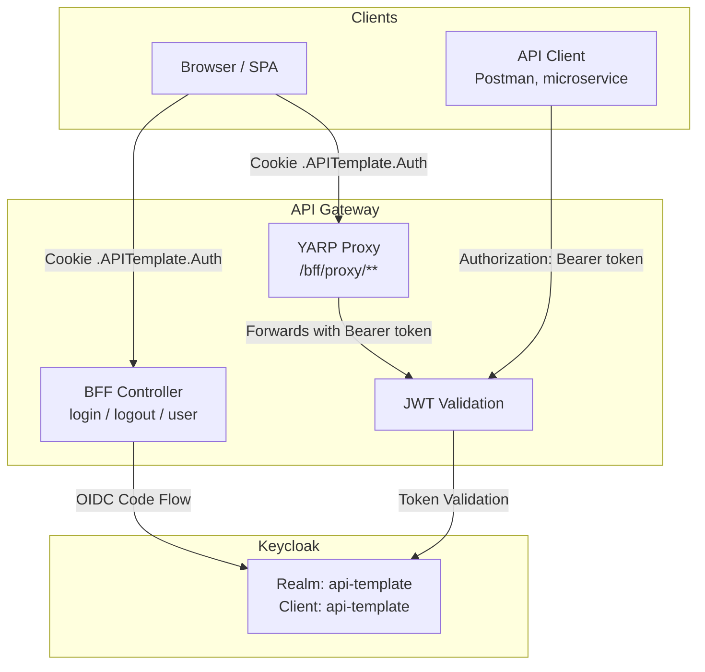

# Authentication & Authorization

## Overview

Project uses **Keycloak** as identity provider with hybrid **BFF (Backend-for-Frontend)** pattern:

- **JWT Bearer** - direct API access (microservices, mobile apps, Postman)
- **OIDC + Cookie** - browser-based login via BFF endpoints
- **YARP Reverse Proxy** - automatically forwards access tokens from cookie sessions

## Architecture



## Quick Start

### 1. Start Infrastructure

```bash
docker-compose up -d
```

Services:
| Service       | Port  | Description              |
|---------------|-------|--------------------------|
| PostgreSQL    | 5432  | Application database     |
| MongoDB       | 27017 | Product data storage     |
| Keycloak      | 8180  | Identity provider        |
| Keycloak DB   | 5433  | Keycloak PostgreSQL      |

### 2. Default Credentials

| Service   | Username | Password |
|-----------|----------|----------|
| Keycloak Admin Console | admin | admin |
| Application User       | admin | Admin123 |

Default user has role **PlatformAdmin** and tenant `00000000-0000-0000-0000-000000000001`.

### 3. Keycloak Admin Console

```
http://localhost:8180/admin
```

## Authentication Flows

### Flow 1: Browser (BFF with OIDC + Cookie)

1. Navigate to `http://localhost:8080/api/v1/bff/login`
2. Browser redirects to Keycloak login page
3. Enter credentials (admin / Admin123)
4. Keycloak redirects back with authorization code
5. Backend exchanges code for tokens (server-side)
6. Session stored in encrypted cookie `.APITemplate.Auth`
7. All subsequent requests use cookie automatically

### Flow 2: Direct API Access (JWT Bearer)

Obtain token from Keycloak directly:

```bash
curl -X POST http://localhost:8180/realms/api-template/protocol/openid-connect/token \
  -H "Content-Type: application/x-www-form-urlencoded" \
  -d "grant_type=client_credentials" \
  -d "client_id=api-template" \
  -d "client_secret=dev-client-secret" \
  -d "username=admin" \
  -d "password=Admin123"
```

> **Note:** Direct Access Grants (Resource Owner Password) is disabled for security.
> Use Standard Flow (authorization code) or Client Credentials.

Then use the token:

```bash
curl http://localhost:8080/api/v1/products \
  -H "Authorization: Bearer <access_token>"
```

## BFF Endpoints

All BFF endpoints are under `/api/v1/bff/`:

### `GET /api/v1/bff/login`

Initiates OIDC login flow. Anonymous access.

| Parameter   | Type   | Required | Description                        |
|-------------|--------|----------|------------------------------------|
| `returnUrl` | string | No       | Redirect URL after login (local only) |

**Response:** HTTP 302 redirect to Keycloak login page.

### `GET /api/v1/bff/logout`

Terminates session and revokes tokens. Requires authentication (Cookie scheme).

**Response:** HTTP 302 redirect to `PostLogoutRedirectUri` (default: `/`).

### `GET /api/v1/bff/user`

Returns current authenticated user info. Requires authentication (Cookie scheme).

**Response:**
```json
{
  "userId": "unique-user-id",
  "username": "admin",
  "email": "admin@example.com",
  "tenantId": "00000000-0000-0000-0000-000000000001",
  "roles": ["PlatformAdmin"]
}
```

## YARP Reverse Proxy (BFF Proxy)

Requests to `/bff/proxy/**` are proxied with automatic token injection:

```
GET /bff/proxy/api/v1/products
  -> strips /bff/proxy prefix
  -> extracts access_token from cookie session
  -> adds Authorization: Bearer <token> header
  -> forwards to internal API as GET /api/v1/products
```

This allows SPAs to call the API without handling tokens directly.

## Token Requirements

JWT tokens must contain these claims:

| Claim                | Description                | Required |
|----------------------|----------------------------|----------|
| `sub`                | Subject (user ID)          | Yes      |
| `preferred_username` | Username                   | Yes      |
| `email`              | User email                 | Yes      |
| `tenant_id`          | Tenant GUID (custom claim) | Yes      |
| `roles`              | User roles                 | No       |
| `aud`                | Must include `api-template`| Yes      |
| `iss`                | Keycloak realm issuer URL  | Yes      |

**Custom Validation:** `TenantClaimValidator` enforces that `tenant_id` is present and is a valid non-empty GUID.

**Claim Mapping:** `KeycloakClaimMapper` maps Keycloak-specific claims to standard .NET ClaimTypes:
- `preferred_username` → `ClaimTypes.Name`
- `realm_access.roles` (nested JSON) → individual `ClaimTypes.Role` claims

## Authorization Policies

| Policy            | Requirement         |
|-------------------|---------------------|
| Default           | Authenticated user  |
| `PlatformAdminOnly` | Role: PlatformAdmin |

## Keycloak Realm Configuration

Realm is auto-imported on startup from `infrastructure/keycloak/realms/api-template-realm.json`.

### Realm: `api-template`

- Self-registration: Disabled
- Brute force protection: Enabled (5 attempts → lockout 1-15 min, reset after 1h)
- Email login: Allowed
- SSL: None (development)
- Remember Me: Enabled (SSO session up to 15 days)
- Password policy: min 8 chars, 1 uppercase, 1 digit, expiry after 365 days
- Session timeouts:
  - Without Remember Me: 30 min idle / 10 hours max
  - With Remember Me: 7 days idle / 15 days max

### Roles

| Role           | Description             |
|----------------|-------------------------|
| PlatformAdmin  | Full platform access    |
| TenantUser     | Regular tenant user     |

### Client: `api-template`

- Type: Confidential
- Secret: `dev-client-secret` (dev only)
- Standard Flow: Enabled
- Direct Access Grants: Disabled
- Redirect URIs: `http://localhost:5174/*`, `http://localhost:8080/*`
- Web Origins: `http://localhost:5174`, `http://localhost:8080`

### Custom Protocol Mappers

| Mapper          | Type              | Source Attribute | Token Claim |
|-----------------|-------------------|------------------|-------------|
| tenant_id       | User Attribute    | `tenant_id`      | `tenant_id` |
| audience-mapper | Audience Mapper   | -                | `aud`       |
| realm-roles     | Realm Role Mapper | realm roles      | `realm_access.roles` |

## Configuration

### appsettings.Development.json

```json
{
  "Keycloak": {
    "realm": "api-template",
    "auth-server-url": "http://localhost:8180/",
    "ssl-required": "none",
    "resource": "api-template",
    "credentials": {
      "secret": "dev-client-secret"
    }
  }
}
```

### BFF Options (appsettings.json)

```json
{
  "Bff": {
    "CookieName": ".APITemplate.Auth",
    "PostLogoutRedirectUri": "/",
    "SessionTimeoutMinutes": 60,
    "Scopes": ["openid", "profile", "email"]
  }
}
```

### Production Environment Variables

| Variable                          | Description                    |
|-----------------------------------|--------------------------------|
| `KC_HOSTNAME`                     | Keycloak external hostname     |
| `KC_REALM`                        | Keycloak realm name            |
| `KC_CLIENT_ID`                    | Client ID                      |
| `KC_CLIENT_SECRET`                | Client secret                  |
| `KC_DB_USERNAME` / `KC_DB_PASSWORD` | Keycloak database credentials |
| `APITEMPLATE_REDACTION_HMAC_KEY`  | HMAC key for log redaction     |

## Testing

### Integration Tests

Tests use a mock JWT authentication setup that bypasses Keycloak:

```csharp
// Authenticate test client with PlatformAdmin role
IntegrationAuthHelper.Authenticate(client, role: UserRole.PlatformAdmin);

// Authenticate with specific tenant
IntegrationAuthHelper.Authenticate(client,
    tenantId: myTenantGuid,
    role: UserRole.TenantUser);
```

Test tokens are signed with RSA-256 using a test key pair and contain all required claims including `tenant_id`.

### Manual Testing with Swagger/Scalar

1. Open API docs at `http://localhost:8080/scalar/v1`
2. Click "Authorize" and enter Bearer token
3. Token flow is documented in OpenAPI spec via `BearerSecuritySchemeDocumentTransformer`

## Key Source Files

| File | Description |
|------|-------------|
| `Extensions/AuthenticationServiceCollectionExtensions.cs` | Authentication setup (JWT + OIDC + Cookie) |
| `Extensions/ServiceCollectionExtensions.cs` | YARP reverse proxy configuration |
| `Extensions/ApplicationBuilderExtensions.cs` | Middleware pipeline order |
| `Api/Controllers/V1/BffController.cs` | BFF endpoints (login/logout/user) |
| `Application/Common/Options/BffOptions.cs` | BFF configuration model |
| `Application/Common/Security/BffAuthenticationSchemes.cs` | Auth scheme constants |
| `Infrastructure/Security/BffTokenTransformProvider.cs` | YARP token injection |
| `Infrastructure/Security/TenantClaimValidator.cs` | Tenant claim validation + logging |
| `Infrastructure/Security/KeycloakClaimMapper.cs` | Keycloak → .NET claim type mapping |
| `Infrastructure/Security/KeycloakUrlHelper.cs` | Keycloak URL construction |
| `Application/Common/Options/KeycloakOptions.cs` | Strongly-typed Keycloak configuration |
| `Infrastructure/Health/KeycloakHealthCheck.cs` | Keycloak health check |
| `infrastructure/keycloak/realms/api-template-realm.json` | Keycloak realm import |
